# Introduction 

The STM32MP157C-DK2 Discovery kits are designed as complete demonstration and development platforms for STMicroelectronics Arm®-based dual Cortex®-A7 32 bits and Cortex®-M4 32 bits MPUs in the STM32MP1 Series. They leverage the capabilities of STM32MP1 Series microprocessors to allow users develop applications using STM32 MPU OpenSTLinux Distribution software for the main processor and STM32CubeMP1 software for the co-processor.

## Hardware Layout and Configuration 

### Block Diagram

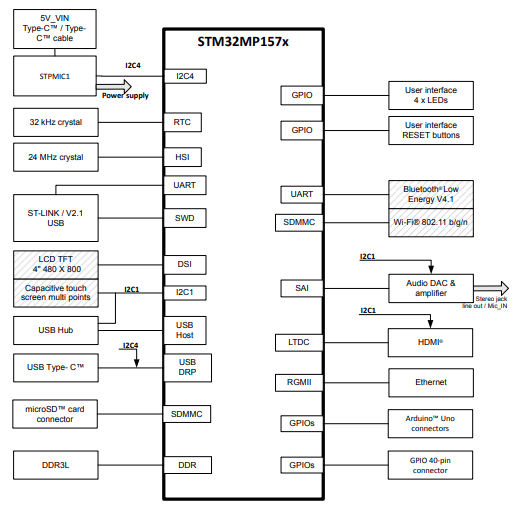

### PCB layout Top Side
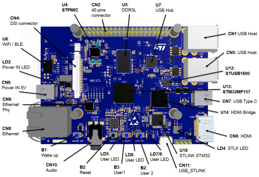

### PCB layout Bottom Side 
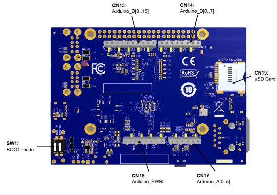

### Clock Sources

** LSE clock references **

The LSE clock references on the STM32MP157x microprocessor are provided by the external crystal X2:32.768 kHz crystal.

** HSE clock references **

The HSE clock references on the STM32MP157x microprocessor are provided by the external crystal X6: 24 MHz crystal.

### Reset Sources 

The reset signal of STM32MP157C-DK2 is active low. The internal PU forces the RST signal to a high level. 
The sources of reset are:

- Reset button B2 (black button)
- STPMIC1
- Embedded ST-LINK/V2.1
- Arduino™ connector CN16: pin 3, reset from the Arduino™ board
- STM32MP157x

### Boot Modes

At startup, the boot source used by the internal bootROM is selected by the Boot pins. Below table describes the configurations of the Boot pins.

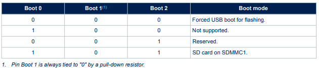

### LEDs

The `LD2` LED turns green when the power cable is inserted in connector CN6.

Two general-purpose color LEDs (LD7 and LD8) are available as light indicators

- The `LD7` orange LED is used as STM32Cube examples verdict LED.
- The `LD8` blue LED is used as Linux® Heartbeat LED, which is blinking as long as Linux® is alive on the Cortex®-A. 

The two user LEDs, the green `LD5` and orange `LD6` LEDs, are directly connected to the STM32MP157x

** Operating voltage ** - 
All LEDs are driven by the I/O level; they are operating in the 3.3 V voltage range.

** I/O Configuration of LEDS **
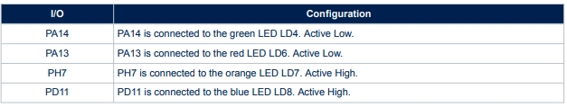

### Buttons

The STM32MP157C-DK2 Discovery kits provide four types of buttons:

- Wake-up button (`B1`)
    - Allows the platform to be woken up from any low-power mode
    - Connected to STPMIC1 PONKEY, which generates a wake up signal on STM32MP157x PA0
- Reset button (`B2`)
    - Used to reset the Discovery kit
- USER1 button (`B3`)
    - Used at boot time by U-Boot to enter the USB programming mode
- USER2 button (`B4`)
    - Used at boot time by U-Boot to enter the Android® Fastboot mode

** I/O Configuration of BUTTONS **
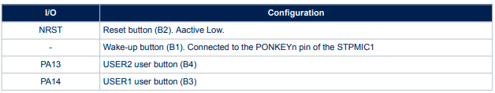

### Arduino™ connectors

The Arduino™ Uno V3 connectors (CN13, CN14, CN16, and CN17) are available on the STM32MP157C-DK2 Discovery kits. The Arduino™ Uno V3 connectors support `5 V, 3.3 V, and VDD` for I/O compatibility.

!!! Warning 
    Do not supply 3.3 V or 5 V from the Arduino™ shield. Supplying 3.3 V or 5 V from the Arduino™ shield could damage the Discovery kit.

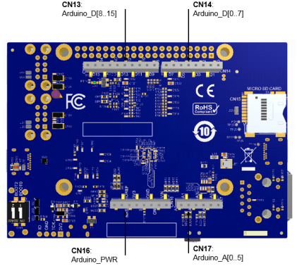

** I/O Configuration of Arduino Interface **

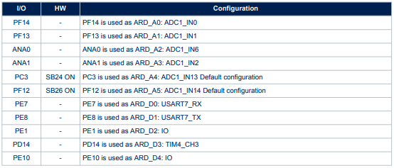
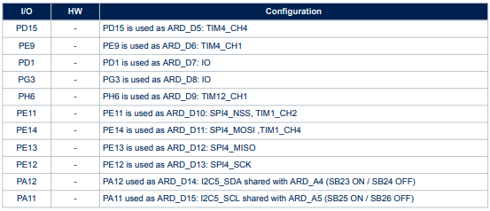

** Arduino Pinout Interface **

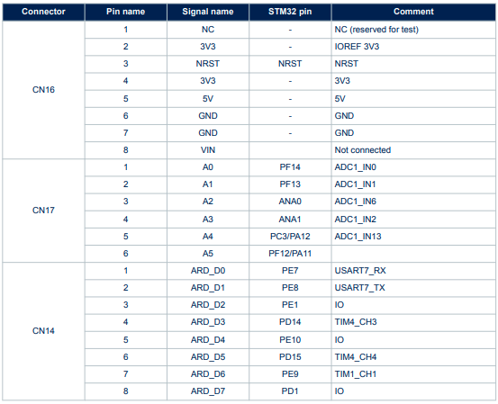
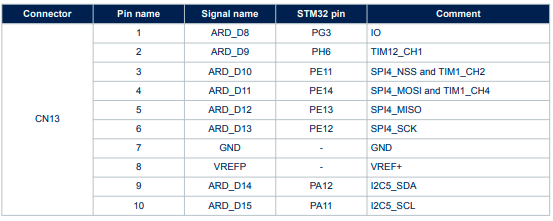

### GPIO Expansion Connectors 

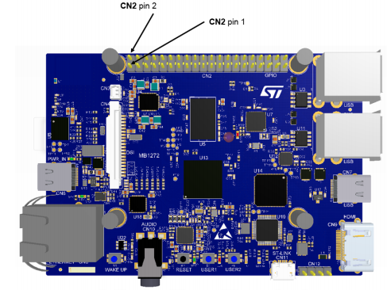

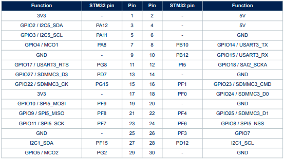
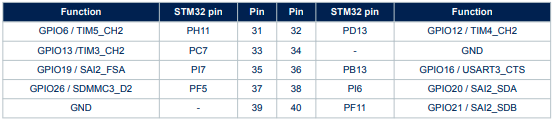

### STM32MP157C-DK2 I/O assignment

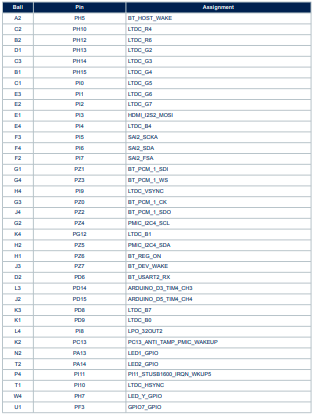

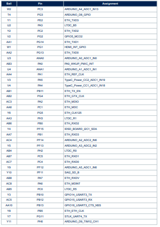
 
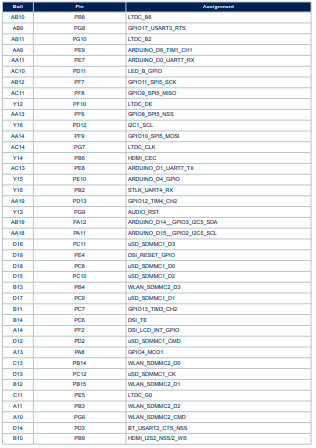
 
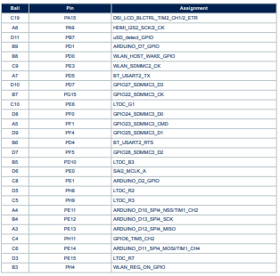

