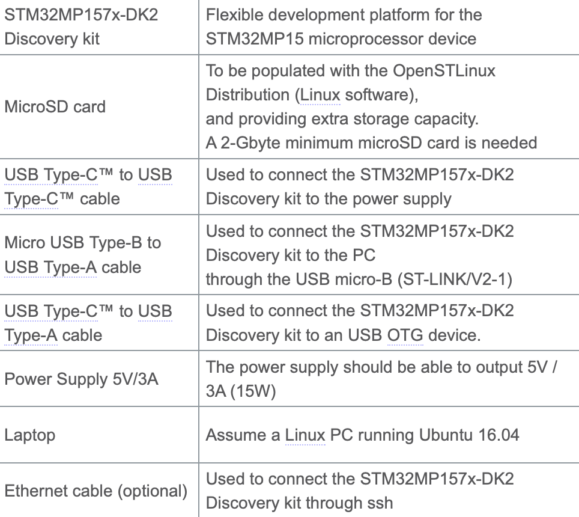
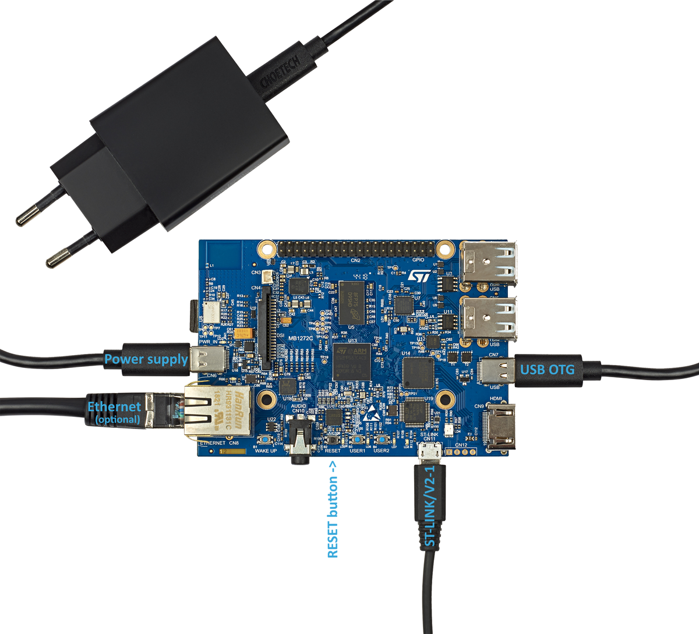
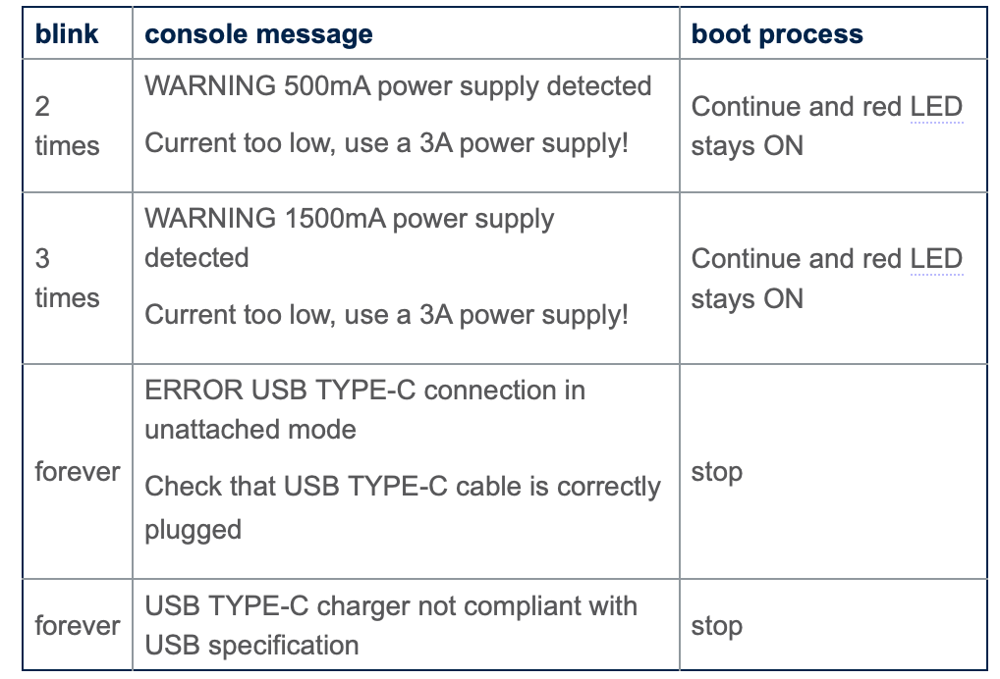

# Getting started with STM32MP157CDK-2

## Required Equipment

The following table lists the required equipment to start playing with your STM32MP157C-DK2 board.

## Connection

- Connect the micro USB Type-B to USB Type-A cable between your laptop and the ST-LINK/V2-1 port of the board
- Connect the USB Type-C™ to USB Type-C™ cable to the 5V/3A power supply
- Connect the USB Type-C™ to USB Type-A cable betweenn your laptop and the USB Type-C™ OTG port of the board
- Optionally connect the Ethernet cable between your Ethernet network and the Ethernet port of the board

- If the board power supply doesn't supply enough current (3A), the red LED indicates the issue following the rules below:

## Execute Basic Commands

This stage explains how to connect the Linux® terminal of your board to your host computer through the ST-LINK/V2-1. Then you will see how to execute basic commands with the Linux command line interface in order to be familiarized with the Linux console.

### The Serial Terminal
The serial terminal allows to communicate with the board trough a UART serial interface.

- On Mac/Linux install minicom by running the following commands respectively  
`$ sudo apt-get install minicom` for Linux.  
`$ brew install minicom` for Mac.

** For Mac **
- Get the port on which the device is connected by running the following command  
`$ ls /dev/tty*` and in my case the port is `/dev/tty.usbmodem142202` 

** For Linux **
- Get the port on which the device is connected by running the following command  
`$ ls /dev/ttyACM*` and you should get the following output `/dev/ttyACM0`

!!! Tip
    Run the command again by disconnecting the dev board from the host computer and notice which port is not listed. The missing port ID is your desired port ID.

- Connect minicom to the minicom -D /dev/ttyACM0 device by running the following command:  
for ** Mac ** `minicom -D /dev/tty.usbmodem142202` and for ** Linux ** `minicom -D /dev/ttyACM0`  

The output screen will be as follows:  

    $ minicom -D /dev/ttyACM0
    Welcome to minicom 2.7.1

    OPTIONS: I18n 
    Compiled on Nov 15 2018, 20:18:47.
    Port /dev/ttyACM0, 15:56:03

    Press CTRL-A Z for help on special keys

- Press the reset button to reset the board. You should see boot log displayed in the minicom window in your host computer. 
    
### Connect using SSH

- This feature works only if the ethernet cable is connected to the board.  

- Determine the board's IP Address by running the following command in board using the serial terminal 
`$ ip addr show eth0`  

- The following code is displayed in your serial terminal. 

        3: eth0: <BROADCAST,MULTICAST,UP,LOWER_UP> mtu 1500 qdisc mq state UP group default qlen 1000
        link/ether xx:xx:xx:xx:xx:xx brd ff:ff:ff:ff:ff:ff
        inet xx.xx.xx.xx/xx  brd xx.xx.xx.xx scope global dynamic eth0
        valid_lft 159045sec preferred_lft 159045sec
        inet6 xxxx::xx:xx:xx:xx/64 scope link 
        valid_lft forever preferred_lft forever 

`inet xx.xx.xx.xx/xx` is your board's IP address. 

- On the host computer connect the terminal to the board using ssh

        $ ssh root@xx.xx.xx.xx
        root@stm32mp1:~#

### Basic Commands 

** Printing distribution specific information **

`$ cat /etc/build`

    -----------------------
    Build Configuration:  |
    -----------------------
    BB_VERSION = 1.46.0
    BUILD_SYS = x86_64-linux
    NATIVELSBSTRING = universal
    TARGET_SYS = arm-ostl-linux-gnueabi
    MACHINE = stm32mp1
    DISTRO = openstlinux-weston
    DISTRO_VERSION = 3.1-openstlinux-5.10-dunfell-mp1-21-03-31
    TUNE_FEATURES = arm vfp cortexa7 neon vfpv4 thumb callconvention-hard
    TARGET_FPU = hard
    MANIFESTVERSION = ostl-21-03-31-rc4-2-g7ef7d27
    DISTRO_CODENAME = dunfell
    ACCEPT_EULA_stm32mp1 = 1
    GCCVERSION = 9.%
    PREFERRED_PROVIDER_virtual/kernel = linux-stm32mp
    PREFERRED_VERSION_linux-stm32mp = 
    -----------------------
    Layer Revisions:      |
    -----------------------
    meta-python       = default.xml:5bba79488b7d393d2258d6e917f7bf7b0d7c4073 
    meta-oe           = default.xml:5bba79488b7d393d2258d6e917f7bf7b0d7c4073 
    meta-gnome        = default.xml:5bba79488b7d393d2258d6e917f7bf7b0d7c4073 
    meta-initramfs    = default.xml:5bba79488b7d393d2258d6e917f7bf7b0d7c4073 
    meta-multimedia   = default.xml:5bba79488b7d393d2258d6e917f7bf7b0d7c4073 
    meta-networking   = default.xml:5bba79488b7d393d2258d6e917f7bf7b0d7c4073 
    meta-webserver    = default.xml:5bba79488b7d393d2258d6e917f7bf7b0d7c4073 
    meta-filesystems  = default.xml:5bba79488b7d393d2258d6e917f7bf7b0d7c4073 
    meta-perl         = default.xml:5bba79488b7d393d2258d6e917f7bf7b0d7c4073 
    meta-st-stm32mp   = default.xml:2e80e33539a193c6a8add6131c4c760009c49cea 
    meta-qt5          = default.xml:0d8eb956015acdea7e77cd6672d08dce18061510 
    meta-st-openstlinux = default.xml:673d7ee4572e3faadec3e43d5f0fa004465b78d9 
    meta              = default.xml:72431ee8de5e3a53d259cebf420a7713ac9e1f14
 

** Printing System Information **

    $ uname -a 
    Linux stm32mp1 5.10.10 #1 SMP PREEMPT Sat Jan 23 15:04:06 UTC 2021 armv7l armv7l armv7l GNU/Linux

** Printing Linux Kernal and GCC versions **

    $ cat /proc/version
    Linux version 5.10.10 (oe-user@oe-host) (arm-ostl-linux-gnueabi-gcc (GCC) 9.3.0, GNU ld (GNU Binutils) 2.34.0.20200220) #1 SMP PREEMPT Sat Jan 23 15:04:06 UTC 2021

** Printing the amount of disk space available on all mounted file systems **

    $ df -h
    Filesystem      Size  Used Avail Use% Mounted on
    devtmpfs        147M     0  147M   0% /dev
    /dev/mmcblk0p6  690M  424M  220M  66% /
    tmpfs           214M   64K  214M   1% /dev/shm
    tmpfs           214M  8.8M  205M   5% /run
    tmpfs           214M     0  214M   0% /sys/fs/cgroup
    tmpfs           214M   20K  214M   1% /tmp
    /dev/mmcblk0p4   58M   14M   40M  27% /boot
    /dev/mmcblk0p5   15M  6.8M  6.7M  51% /vendor
    tmpfs           214M  144K  214M   1% /var/volatile
    /dev/mmcblk0p7   28G   38M   26G   1% /usr/local
    tmpfs            43M     0   43M   0% /run/user/0

