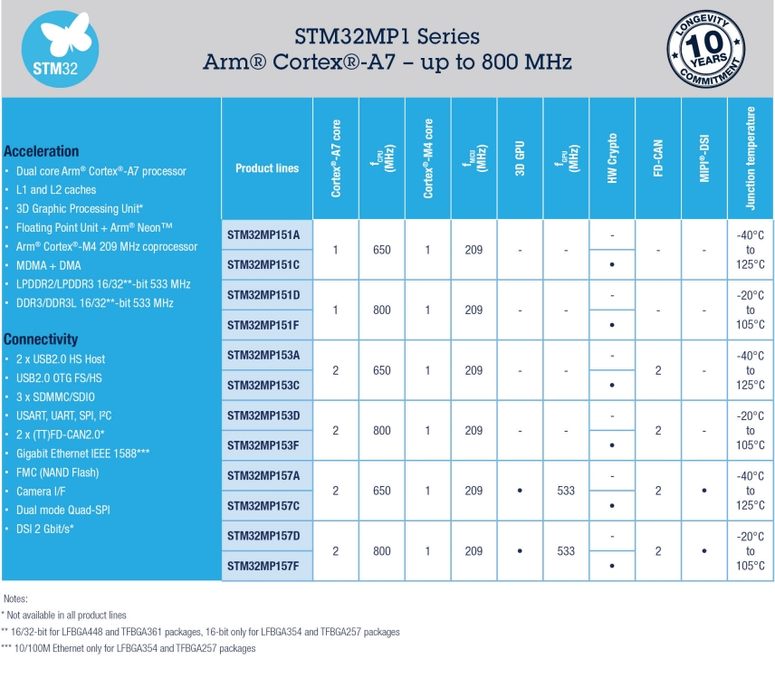

# The STM32MP1 Microprocessor Series 

# 10 Year Longitivity Commitment by ST

The STM32MP1 series is available in 3 different lines which are pin-to-pin compatible:

- STM32MP157: Dual Cortex-A7 cores up to @ 800 MHz, Cortex-M4 core @ 209 MHz, 3D GPU, DSI display interface and CAN FD
- STM32MP153: Dual Cortex-A7 cores up to @ 800 MHz, Cortex-M4 core @ 209 MHz and CAN FD
- STM32MP151: Single Cortex-A7 core up to @ 800 MHz, Cortex-M4 core @ 209 MHz

## STM32MP1 Series Comparision

## Flexible architecture

The single or dual Cortex-A7 cores are dedicated to open-source operating systems while the Cortex-M4 core is dedicated to real-time and low-power tasks.

- Dual Cortex®-A7 cores running at 800 MHzßß
    - 32-Kbyte L1 Instruction cache
    - 32-Kbyte L1 Data cache
    - 256-Kbyte Level 2 cache

- Cortex®-M4 core running at 209 MHzß
    - a single-precision floating point unit (FPU)
    - a full set of digital signal processor (DSP) instructions
    - memory protection unit for enhanced application security

